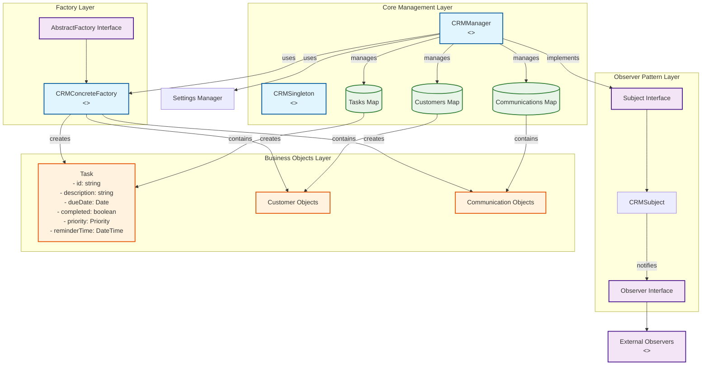

# CMR System

## 第二流程图

```mermaid
graph TB
    %% Factory Layer
    subgraph "Factory Layer"
        AF[AbstractFactory Interface]
        CF[CRMConcreteFactory<br/><<singleton>>]
        AF --> CF
    end

    %% Core Management Layer  
    subgraph "Core Management Layer"
        CRMS[CRMSingleton<br/><<singleton>>]
        CRMM[CRMManager<br/><<singleton>>]
        
        CRMM -->|uses| CF
        CRMM -->|manages| CUSTOMERS[(Customers Map)]
        CRMM -->|manages| COMMUNICATIONS[(Communications Map)]
        CRMM -->|manages| TASKS[(Tasks Map)]
    end

    %% Observer Pattern Layer
    subgraph "Observer Pattern Layer"
        SUBJ_INT[Subject Interface]
        CRMSUB[CRMSubject]
        OBS_INT[Observer Interface]
        
        SUBJ_INT --> CRMSUB
        CRMSUB -->|notifies| OBS_INT
        CRMM -->|implements| SUBJ_INT
    end

    %% Business Objects Layer
    subgraph "Business Objects Layer"
        TASK[Task<br/>- id: string<br/>- description: string<br/>- dueDate: Date<br/>- completed: boolean<br/>- priority: Priority<br/>- reminderTime: DateTime]
        CUSTOMER[Customer Objects]
        COMMUNICATION[Communication Objects]
    end

    %% Relationships and Data Flow
    CF -->|creates| CUSTOMER
    CF -->|creates| COMMUNICATION  
    CF -->|creates| TASK

    CUSTOMERS -->|contains| CUSTOMER
    COMMUNICATIONS -->|contains| COMMUNICATION
    TASKS -->|contains| TASK

    %% External Observers
    EXT_OBS[External Observers<br/><<interface>>]
    OBS_INT --> EXT_OBS

    %% Settings Management
    SETTINGS[Settings Manager]
    CRMM -->|uses| SETTINGS

    %% Styling
    classDef singleton fill:#e1f5fe,stroke:#01579b,stroke-width:2px
    classDef interface fill:#f3e5f5,stroke:#4a148c,stroke-width:2px
    classDef datastore fill:#e8f5e8,stroke:#2e7d32,stroke-width:2px
    classDef business fill:#fff3e0,stroke:#e65100,stroke-width:2px

    class CRMS,CRMM,CF singleton
    class AF,SUBJ_INT,OBS_INT,EXT_OBS interface
    class CUSTOMERS,COMMUNICATIONS,TASKS datastore
    class TASK,CUSTOMER,COMMUNICATION business
```
## 第三

